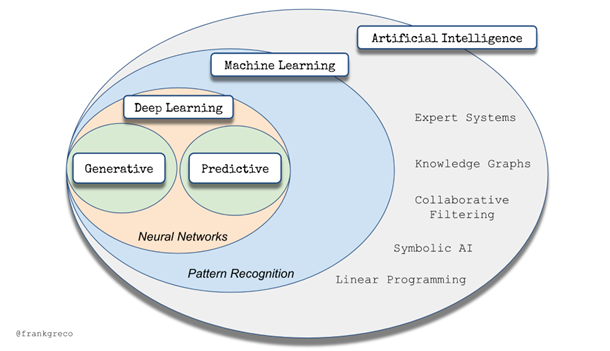

# Emma

____

### [AI Libraries in Java](https://bayramblog.medium.com/artificial-intelligence-with-java-programming-812b8adb1620)

#### Expert Systems
* Apache Jena — a framework to create web and linked data applications.
* PowerLoom — a platform to build knowledge-based applications and reasoning systems.
* d3web — a reasoning engine with many algorithms to solve given problems.
* Eye — a reasoning engine to perform semi-backward reasoning.
* Tweety — a collection of frameworks for logical aspects of AI and knowledge representation.

#### Neural Networks
* Neuroph — an open-source framework for neural network creation.
* Deeplearning4j — a deep learning library for JVM that also provides API for neural network creation.

#### Natural Language Processing
* Apache OpenNLP — a toolkit to process the natural language text.
* Stanford CoreNLP — a framework to perform NLP tasks.

#### Machine Learning
* Java-ML — a collection of machine learning algorithms.
* RapidMiner — a data science platform that provides machine learning algorithms through GUI and Java API.
* Weka — a collection of machine learning algorithms.
* Encog — a collection of advanced algorithms.

#### Genetic Algorithms
* Jenetics — an advanced genetic algorithm.
* Watchmaker — a framework for implementing genetic algorithms.
* ECJ 23 — a research framework with support for genetic algorithms.
* JGAP (Java Genetic Algorithms Package) — a genetic programming component.
* Eva — a simple OOP evolutionary algorithm framework.

#### Automatic programming
* Spring Roo — a lightweight developer tool.
* Acceleo — a code generator for Eclipse which creates code from EMF models.
